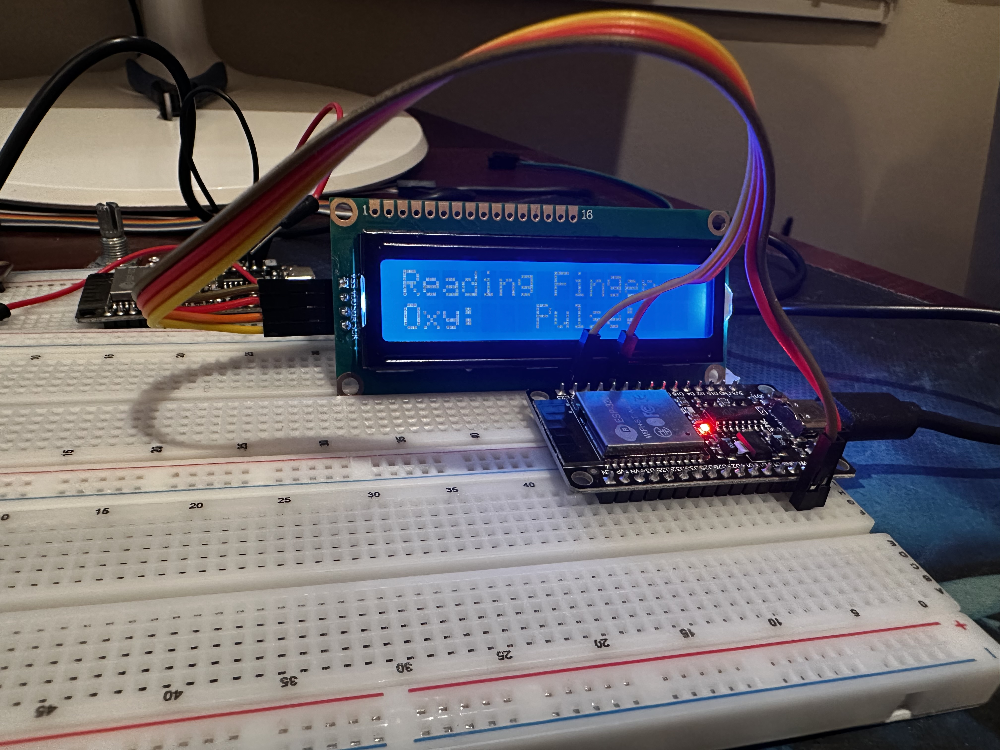
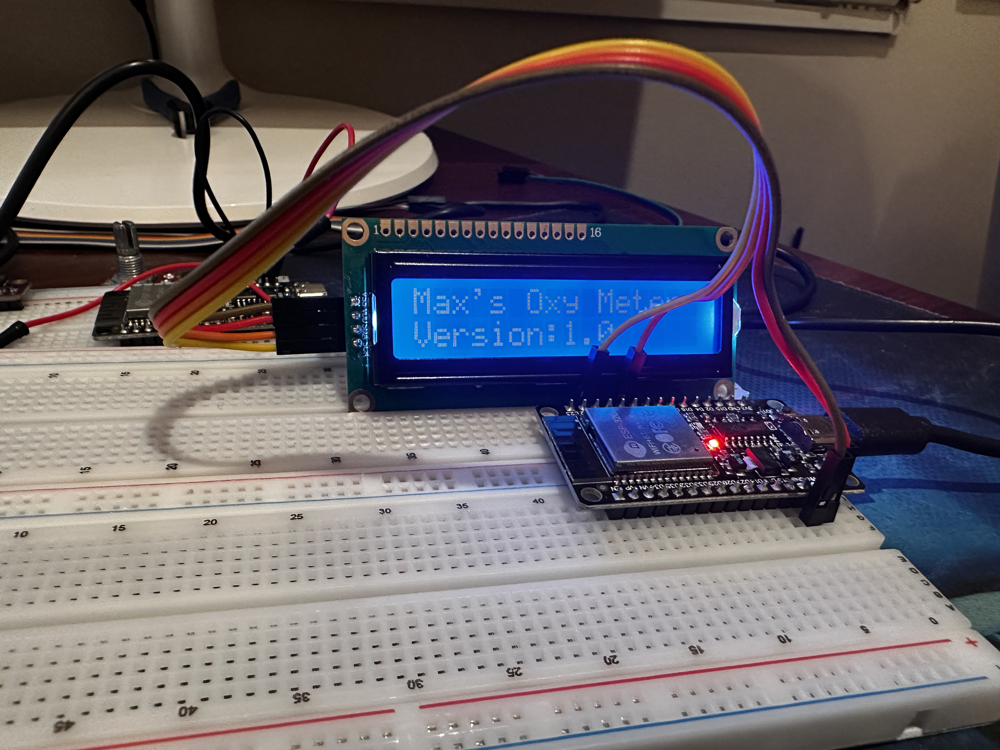
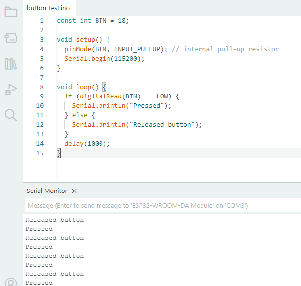

# Recovery-Time Pulse Oximeter

**Technological Outcome — NZ Digital Technologies Assessment 2025**  
A timer project that uses an ESP32 and MAX30102 sensor to monitor SpO₂ (oxygen saturation) and heart rate during recovery after exertion.

## 🔍 Project Overview

This device tracks how quickly a person's vitals return to target levels after exercise. When the user presses Start, the timer begins and live readings are shown. The device automatically stops when target thresholds are met or a timeout is reached, then shows a summary of the session.

## 🎯 Features

- Real-time SpO₂ and heart rate monitoring
- Start/Stop/Reset button interface
- Auto-stop on target thresholds (e.g., SpO₂ ≥ 96%, HR within 10% of baseline)
- Session summary: time, min SpO₂, max HR, time-to-target
- OLED or LCD display output
- Optional data logging to EEPROM or over Serial (CSV)
- Buzzer feedback for target hit / timeout

## 🧩 Components Used

| Component      | Description                          |
|----------------|--------------------------------------|
| ESP32 Dev Board| Microcontroller with BLE/Wi-Fi       |
| MAX30102       | Pulse oximeter & heart rate sensor   |
| OLED/LCD1602   | Display for live values and summary  |
| Pushbuttons    | For Start / Stop / Reset             |
| Buzzer         | Audible cue when session ends        |
| (Optional) EEPROM | For data storage (or use SPIFFS) |

## 🖧 Wiring Diagram

_(Insert Fritzing or diagram here once available)_

- MAX30102 → SDA/SCL to ESP32 (I²C)
- Display → I²C (or parallel if LCD1602)
- Buttons → GPIO with pull-down resistors
- Buzzer → GPIO with limiting resistor

## 🚦 State Machine

```text
IDLE → RUNNING → TARGET_REACHED / TIMEOUT → SUMMARY → IDLE
```

## 📊 Example Output

```csv
Session,Start Time,Duration (s),Min SpO2 (%),Max HR (bpm),Target Time (s)
1,2025-08-22 10:31,42,93,132,36
2,2025-08-22 10:45,51,92,128,44
```

## 🔍 Assessment Alignment

| Requirement                        | Covered |
|------------------------------------|---------|
| Repeatable user control            | ✅ Start/Stop/Reset buttons |
| Output via display/CSV             | ✅ OLED or LCD, optional CSV |
| Use of advanced techniques         | ✅ ESP32 code, subsystem design, storage |
| Data captured/stored               | ✅ Session summary stored |
| Relevant implications addressed    | ✅ Privacy, safety, usability, sustainability |
| Testing & modification documented  | ✅ In dev log and black-box tests |

## 📹 Video Demo (Coming Soon)

## 🧪 Testing & Logs

- Weekly black-box testing with two users
- Dev logs with screenshots, code versions, test notes
- Interface behaviour and improvements tracked

### ✅ Stage 1 — LCD Smoke Test

**Goal:** Prove the I²C 1602A LCD works on ESP32 (text visible, no flicker).  
**Method:** `TestPrograms/lcd-tests/lcd-tests.ino`  
**Pass:** Clear text on both lines; stable for ≥60s.

**Evidence:**
- Photos:  
    
  
- Video: [docs/videos/lcd-test.mov](docs/videos/lcd-test.mov)
- 
### ✅ Stage 2 — Button Test

**Goal:** Verify push button input using GPIO18 with `INPUT_PULLUP`.  
**Method:** Button wired between GPIO18 and GND. Code prints `Pressed`/`Released` via Serial Monitor.  
**Pass:** 50 presses with no false triggers.

**Evidence:**
- Screenshot:  
  
- Source: `TestPrograms/button-test/button-test.ino`

### ✅ Stage 3 — Buzzer Test

**Goal:** Confirm audible output using an active buzzer on GPIO19.  
**Method:** Pin 19 drives buzzer; code pulses 200 ms on / 800 ms off.  
**Pass:** Distinct beeps heard once per second.

**Evidence:**
- Clip: [docs/videos/buzzer-test.mov](docs/videos/buzzer-test.mov)
- Source: `TestPrograms/buzzer-test/buzzer-test.ino`


## 📄 License

This project uses open-source libraries. See [LICENSE](LICENSE) for more.


